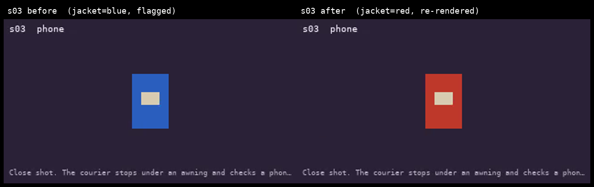
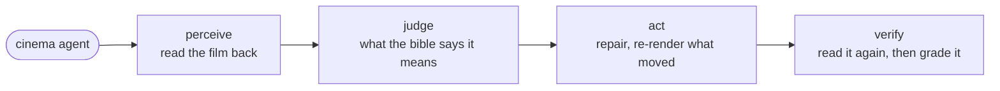
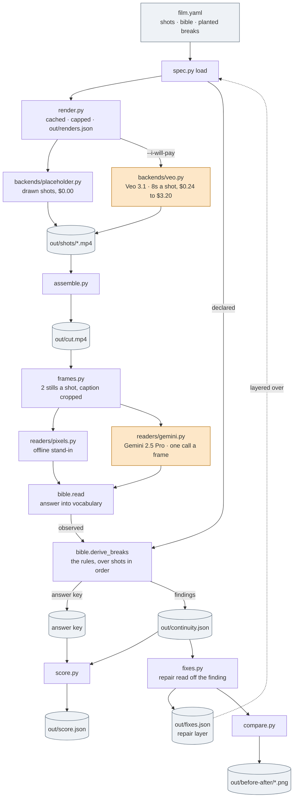
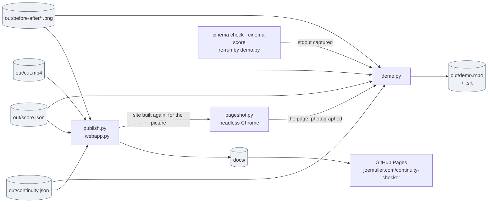

# Continuity checker, for Agentic Cinema

An agent that watches the film it just made. Everyone generating film with a model has the
same problem: the courier's jacket is red in shot two and blue in shot three, and nothing in
the pipeline notices. This one reads the finished cut back, decides which shots broke,
repairs them, re-renders only those, and then checks its own work.

The loop is deterministic and it is the same four steps every pass. `cinema/agent.py` holds
one function per step and runs them in order, as a graph in Google's Agent Development Kit:

| Step | What happens | Where |
|---|---|---|
| **Perceive** | Sample frames from each shot and ask Gemini a fixed set of questions about them | `cinema/check.py`, `cinema/readers/` |
| **Judge** | Fold the answers into the shot bible's vocabulary and apply its rules. A change is a break only when the rule says so | `cinema/bible.py` |
| **Act** | Write a repair off the finding, then re-render the shots whose inputs moved and no others | `cinema/fixes.py`, `cinema/render.py` |
| **Verify** | Read the new cut back and grade the run against a key the reader never saw | `cinema/score.py` |



| | |
|---|---|
| Hosted page | [joemuller.com/continuity-checker](https://joemuller.com/continuity-checker/), where the cut, the report and the run are laid out shot by shot |
| Demo video | `out/demo.mp4`, under three minutes, cut from that same run by `python3 -m cinema demo`. Captions in `out/demo.srt` |
| What it needs | Python 3.12, `ffmpeg`, `ffprobe`, and the three packages in [`requirements.txt`](requirements.txt). It runs with no credential, no key and no account |

## Who it is for

Anyone building a film one generation call at a time. The model has no memory of the shot
before, so the wardrobe, the props and the light drift, and the only thing catching it is a
person watching the export. Over five shots that is an annoyance. Over fifty nobody catches
it at all, and by the time somebody does, the re-render bill is the whole film instead of
one shot.

Reading a film is cheap next to making one. Gemini 2.5 Pro reads a 40-second cut for about
$0.04, where rendering the same 40 seconds at full quality costs $16.00
([`notes/render-cost.md`](notes/render-cost.md)). At that ratio it is hard to argue for not
checking.

## Try it

From a clean checkout, on Python 3.12. It costs nothing to run and needs no credential.

```sh
sudo apt install ffmpeg          # or: brew install ffmpeg
git clone https://github.com/jtmuller5/continuity-checker && cd continuity-checker
python3 -m venv .venv && . .venv/bin/activate
pip install -r requirements.txt

python3 -m cinema build   # render five shots, join them into out/cut.mp4
python3 -m cinema check   # read the cut back and report what broke
python3 -m cinema agent   # the four steps above, as an ADK graph: perceive, judge, act, verify
python3 -m unittest discover -s tests    # 287 tests, no network
```

`ffmpeg` brings `ffprobe` with it, and it is the only thing here that is not a pip install.
Of the three packages, only `PyYAML` is needed to build, check, score and fix the film;
`google-adk` runs the loop as a graph, and `google-genai` is imported by the Vertex AI
backend and the Gemini reader alone. Each says what to install if you skip it.

`check` prints:

```
2 continuity break(s):
  s03  jacket: should be red, found blue  (constant)
  s04  parcel: should be present, found absent  (constant)
fix the earliest first: python3 -m cinema render --shot s03
```

The three of them take about two seconds, because the shots are drawn rather than generated.
The renderer is ffmpeg boxes standing in for Veo, and the two breaks in that cut were planted
on purpose: the jacket in shot three, the parcel in shot four. So the sampling, the
vocabulary, the rules and the scoring were all built against a film whose answer is already
known, before a second of video was billed. Swap the backend and the same commands render on
Veo 3.1.

## Where it stands

The pipeline, the check, the score, the repair, the page and the video all run, and the test
suite is green with no network. Detection is Gemini on Vertex AI, one call per frame, and it
has not run yet: access and the budget behind it are still open. A pixel reader stands in for
it, reading the placeholder cut's own boxes, so every number in this repo measures the
plumbing rather than the detection. The report and the page both name the reader that
produced them.

## The thing that is not obvious

Flagging every change is not checking. The sun setting between shot three and shot four is
the story, and the jacket turning blue is a mistake. So the film carries a bible: for each
tracked thing, the words an answer may use, and the rule that decides whether a change in it
is an error. The same bible writes the generation prompt, so what the film was asked for and
what the check looks for cannot drift apart.

The checker is never shown the answer. It gets the question and the vocabulary and nothing
else: not the canon, not the shot's declared state, not the planted breaks. Most of what
follows is about keeping it that way, because a checker that has been told what to find will
find it.

## The shot bible

A checker with no ground truth is only asking a model for an opinion. `film.yaml` carries
the bible: the characters and props, and for each tracked attribute the words an answer may
use and the rule that says whether a change in it is an error. The rule is the part a
longer prompt cannot do, because not everything that changes is a mistake.

| rule | means | in this film |
|---|---|---|
| `constant` | the value must never leave `canon` | the courier's jacket, the parcel |
| `progressive` | the value moves along `order` and never back | the light, dusk then night |
| `declared` | constant, except at the shots the author lists in `changes_at` | the keeper's lamp, lit from shot four, in the second film |

One function judges the film, and it is handed two different readings of it: the state
declared in `film.yaml`, which gives the answer key, and the state Gemini reads out of the
frames, which gives the finding. The spec refuses to load if the hand-written answer key
and the shots disagree, so fixing a shot means retiring its answer-key entry in the same
edit.

## The check

Four steps, and each one knows less than the one before it.

1. Take a few stills per shot. Two, by default: one frame is one moment, and a moment can
   be unlucky. Two frames also catch a break that happens inside a shot.
2. A reader answers the bible's questions about each still. It gets the question and the
   words it may use. It does not get the canon, the shot's declared state, or the answer
   key, because a checker told the answer will find it.
3. Each answer is folded into the vocabulary. A word the bible never offered becomes an
   unanswered question, never a quiet agreement, and every reply may be `unclear`. A
   checker with no way to abstain guesses, and a guess looks exactly like a finding.
4. The rules run across the shots in order. That last step is the same function that turns
   the declared state into the answer key: one judgement, two readings of the film.

Frames of one shot that disagree are reported rather than resolved, and left out of the
judgement. Two frames contradicting each other is either a break inside the shot or a
checker that cannot see, and both are worth a person's attention.

Detection is Gemini on Vertex AI, one call per frame, replying as JSON against an enum
schema. It has not run yet: Vertex AI access and the budget behind it are still open work,
so the tests assert the shape of the request and what it withholds rather than the API.
Meanwhile a pixel reader stands in. It reads the placeholder cut's own boxes, the same trade
the placeholder renderer makes, and it is what lets the sampling, the vocabulary, the
reconciliation and the rules all be tested at $0.00 against a cut whose answer is known.

Ten frames cost about a third of a cent to read. One shot costs $3.20 to render.

## The score

`python3 -m cinema score` is the only thing that reads the report and the answer key. It
runs afterwards, on the written report, so nothing it knows can reach the reader.

It reports two things, because they fail differently. **Breaks**: found, missed, invented,
and, separately, the near miss, which is the right shot and the right attribute read with
the wrong values. Seeing something there and reading it correctly are different skills and
are fixed in different places, so folding a near miss into either total hides which one
went wrong. **Cells**: every shot against every tracked attribute, declared against read. A
misread cell in an otherwise clean shot is what manufactures a false alarm, and it shows up
here a stage before it becomes one.

A cell the checker disputed or could not answer counts as neither right nor wrong, and both
keep the run off a perfect score. The risk on this idea is detection quality on subtle
breaks, and a checker that copes by going quiet must not grade as though it saw them.

On the placeholder cut the score is 2 of 2 planted breaks, no false alarms, 15 of 15 cells.
That measures the pipeline, not the detection: the reader is the offline stand-in. The
number that matters needs Gemini, and Vertex AI access is still open work.

## The fix

`python3 -m cinema fix` is the demo, in one command:

1. Keep the broken frame. A re-rendered shot overwrites its own file, so this is the last
   moment that picture exists.
2. Read the repair off the finding. A break names what the shot should have been as well as
   what it is, so nothing has to be guessed.
3. Write it to `out/fixes.json`, a layer over the spec, never into `film.yaml`. The planted
   breaks are the fixture this thing is scored against, and a tool that edits its own answer
   key can report any accuracy it likes. `--revert` drops the layer.
4. Re-render. The repaired shots have new cache keys and the rest do not, so two shots are
   redrawn and three are skipped.
5. Check again, and score. A repaired film is not declared fixed; it is read back.
6. Write `out/before-after/<shot>.png`: the broken frame beside the fixed one.

Layering the repair rather than patching the spec also buys a guard: the loader derives the
breaks again over the repaired film, so a fix that resolves one break and creates another
is refused instead of shipped.

## The agent loop

Those six steps are four: perceive, judge, act, verify. `cinema/agent.py` is one function
per step, and `python3 -m cinema agent` runs them as a
[`google.adk.workflow.Workflow`](https://google.github.io/adk-docs/), Google's Agent
Development Kit, with each function as a node and one edge to the next:



No model decides the order, so a whole turn runs offline and costs nothing. The judgement
inside `perceive` is Gemini's and the rules inside `judge` are the bible's; what the graph
adds is the sequencing: which step runs when, what it hands the next one, and a session
that records what each of them found.

`cinema fix` calls the same four functions directly, in the same order. There is one copy of
each, so the two paths cannot drift, and the graph is a way of running the loop rather than a
second implementation of it. Each step decides one thing and says so:

* **Perceive** re-reads the film when the last report no longer describes it. A report
  written before a shot was re-rendered describes a film that is gone, and acting on it is
  how a demo of this kind quietly lies.
* **Judge** reads the repair off the finding, because the break already names what the shot
  should have been. Deriving it again would be a second opinion on a settled question.
* **Act** keeps the broken frame before it overwrites the shot, then lets the cache decide
  what is re-rendered.
* **Verify** reads the repaired film rather than declaring it fixed, and the scorer runs last
  and on the written report, so nothing it knows can reach the reader.

## The page

**[joemuller.com/continuity-checker](https://joemuller.com/continuity-checker/)** carries
the cut, the report, the two before/after plates, and the run itself, shot by shot.

Pick a shot on it and you get the stills the checker sampled, the questions it was handed,
what it answered about each still, and the verdict the scorer wrote. The whole run is
inlined into the page, so it works from a local file with no server and no build step, and
nothing on it is decided in the browser: `cinema/webapp.py` arranges the two files
`cinema score` reads and stops there. A judgement made in the JavaScript would be a second
checker, and then the numbers on the page would be measuring the difference between the two.

There is more than one film on it, and the picker is the reason: a checker only ever run
against one cut is indistinguishable from a checker with that cut's answer written into it.
`film-lighthouse.yaml` breaks in two ways `film.yaml` cannot. Its light goes backwards in
the last shot, which a rule that flagged every change would miss while reporting the sunset.
Its lamp is lit from shot four because the bible says so, and that has to read as clean.
Rendering a second film into `out/<name>/` is all it takes to put it on the page:

```sh
python3 -m cinema --spec film-lighthouse.yaml --out out/lighthouse build
python3 -m cinema --spec film-lighthouse.yaml --out out/lighthouse check
python3 -m cinema --spec film-lighthouse.yaml --out out/lighthouse score
python3 -m cinema --spec film-lighthouse.yaml --out out/lighthouse fix
```

`publish` treats any folder under `out/` with a `score.json` in it as a run and serves each
one's stills from its own folder, because both films have an s01. That is a rule rather than
a flag, so the page a test rebuilds and the page in `docs/` cannot be two different pages.

It is generated by `python3 -m cinema publish`, out of the files each run wrote:
`score.json`, `continuity.json`, the plates and the cut. Nothing on it is typed in.
A page with "2 of 2 breaks found" in its source keeps saying that after the checker starts
missing them, which is the failure this whole entry is an argument against, so the page
refuses to build when the artefacts are not there and names the reader beside every number.
A test compares the checked-in page against a fresh build, so a stale one fails the suite.

## Every command

```sh
python3 -m cinema info        # the spec, and the answer key
python3 -m cinema bible       # the ground truth, and the questions the checker asks
python3 -m cinema bible --prompts    # what each shot is actually generated from
python3 -m cinema build       # render what has changed, join it into out/cut.mp4
python3 -m cinema check       # read the cut back, report the breaks
python3 -m cinema score       # grade that report against the answer key it never saw
python3 -m cinema fix         # repair, re-render only what moved, check again, plate it
python3 -m cinema agent       # the same four steps, run as an ADK workflow graph
python3 -m cinema fix --revert         # put the planted breaks back
python3 -m cinema render --shot s03    # re-render one shot by hand
python3 -m cinema timings     # wall clock and spend, per shot
python3 -m cinema publish     # build docs/, the hosted page, from the last run
python3 -m cinema demo        # cut out/demo.mp4 from that same run
python3 -m unittest discover -s tests
```

Make the submission in this order. The order matters:

```sh
python3 -m cinema build && python3 -m cinema check && python3 -m cinema score
python3 -m cinema fix                  # the repair, and the before/after plates
python3 -m cinema fix --revert && python3 -m cinema build   # back to the planted film
python3 -m cinema check && python3 -m cinema score
python3 -m cinema publish && python3 -m cinema demo
```

`publish` and `demo` both need the plates `fix` writes, and both report what the last check
found. So a cut made while the repairs are still applied shows those plates over the words
"0 planted, 0 found", and every command in that run still exits 0. That is why `demo` says
so before it cuts anything. `tests/test_endtoend.py` walks the sequence through the CLI.

Rendering is cached and resumable. A shot is redrawn when its inputs change and skipped
when they have not, so fixing the one broken shot costs one shot: on Veo 3.1 Standard that
is $3.20 rather than $16.00. The ledger is written after every shot, so a killed pass costs
one render rather than the whole film, and each output is checked against its own digest:
delete a shot and it comes back.

What counts as an input is the backend's to declare. Veo reads the model tier, the seed and
the reference image, so a fixed shot three correctly makes shots four and five stale, since
shot three's last frame is shot four's reference. The placeholder backend reads none of
them, so switching tiers while iterating does not redraw five identical boxes.

## How it fits together

One run: render the film, read it back, judge it, repair it. The two shaded boxes are the
only ones that leave the machine, and both are Vertex AI in `us-central1`. Everything else
is Python and ffmpeg where you typed the command, and it needs no credential.



Two edges into `derive_breaks` are the whole idea. The declared state in `film.yaml` goes in
one side and comes out as the answer key; what the reader saw in the frames goes in the
other and comes out as the findings. Same function, same rules, two readings of the film, so
the score measures the reader rather than the gap between two comparisons.

`out/fixes.json` is the one arrow pointing backwards, and it stops at the loader. A repair is
layered over the spec the next time the film is loaded; it is never written into `film.yaml`,
because that file holds the answer key this thing is graded against.

Nothing a judge reads is typed by hand either. The page and the video are built out of the
files the run wrote, so a worse run makes a worse page:



`demo.py` runs `check` and `score` again rather than quoting them, so the two console panels
in the video are that run's real output. It also rewrites `out/continuity.json` on the way
past, which is why the page is published again in the same change.

## How it is laid out

| | |
|---|---|
| `film.yaml` | the five shots, their continuity state, the bible, and the planted breaks |
| `film-lighthouse.yaml` | a second film, breaking the two ways the first one cannot |
| `cinema/agent.py` | the four steps of the turn, and the ADK graph that runs them |
| `cinema/bible.py` | the ground truth: vocabulary, the break rules, and the prompt it writes |
| `cinema/spec.py` | reads the spec and refuses one that could not be re-rendered |
| `cinema/check.py` | the check: sample, read, fold, judge, and the report it writes |
| `cinema/score.py` | the only place the report and the answer key are both read |
| `cinema/fixes.py` | the repair layer, kept beside the render ledger and never in the spec |
| `cinema/compare.py` | the before/after plate: the broken frame beside the fixed one |
| `cinema/frames.py` | pulls the stills, and crops the caption off before anything reads them |
| `cinema/readers/gemini.py` | Gemini on Vertex AI: the detector, one call per frame |
| `cinema/readers/pixels.py` | a free offline stand-in, so the check can be tested with no credential |
| `cinema/vocab.py` | what kind of question an attribute's words make it. The renderer and that reader agree here or nowhere |
| `cinema/render.py` | the cached, resumable render loop, and the ledger it writes |
| `cinema/pricing.py` | Veo's per-second rates, so a render's cost is known before it runs |
| `cinema/backends/placeholder.py` | free local shots, so the pipeline can be built offline |
| `cinema/backends/veo.py` | Veo 3.1 on Vertex AI: written, and unrun until it has a budget |
| `cinema/assemble.py` | joins shots by stream copy, and probes what came out |
| `cinema/publish.py` | the hosted page, built from the run's own output rather than written |
| `cinema/webapp.py` | the shot-by-shot inspector on that page, which decides nothing itself |
| `cinema/demo.py` | the submission video, cut from the same files and the real console output |
| `cinema/pageshot.py` | photographs that page for the video, and refuses a blank rectangle |
| `notes/render-cost.md` | what a shot costs, priced off Google's own tables |

Every shot is eight seconds. Veo's reference-image-to-video mode only accepts eight, and
the re-render step feeds the previous shot's last frame in as its reference, so a shorter
shot would be one the pipeline could never fix. `spec.py` rejects any other length.

The Veo backend refuses to run without an explicit flag. Rendering costs money and the agent
building this has a spend cap of zero, so that guard lives in the code where it can stop a
command.

Behind the flag is a ceiling. `render.max_spend_usd` in `film.yaml` says what the film may
cost in total, and a pass is priced against it twice: once before the first call, from the
cache and the published rate card, and again before each shot as the ledger's running total
climbs. Going over stops the pass where it stands. The shots already paid for stay on disk
and in the ledger, so the next run carries on rather than starting again. What a projection
quotes is what the pass then charges, cascade included: a re-rendered shot changes the
reference frame the next one is built from, so everything after it has to be bought again.

It is written all the same, and it has never run. `request()` builds the call as a plain
dict: the model the tier picks, the eight seconds, the composed prompt, the seed, the
reference frame, and Veo's prompt rewriter switched off. The tests assert that dict on a
machine with no SDK installed, so the first paid pass is not also the first time anyone
reads the code.

---

Built by an autonomous agent working for Joe Muller. MIT licensed: see [`LICENSE`](LICENSE).
